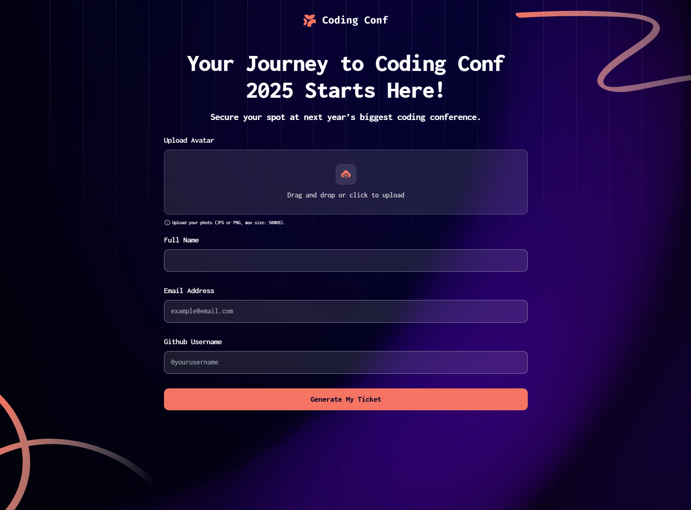

# Frontend Mentor - Conference ticket generator solution

This is a solution to the [Conference ticket generator challenge on Frontend Mentor](https://www.frontendmentor.io/challenges/conference-ticket-generator-oq5gFIU12w). Frontend Mentor challenges help you improve your coding skills by building realistic projects. 

## Table of contents

- [Overview](#overview)
  - [The challenge](#the-challenge)
  - [Screenshot](#screenshot)
  - [Links](#links)
- [My process](#my-process)
  - [Built with](#built-with)
  - [What I learned](#what-i-learned)
  - [Useful resources](#useful-resources)
- [Author](#author)

**Note: Delete this note and update the table of contents based on what sections you keep.**

## Overview

### The challenge

Users should be able to:

- Complete the form with their details
- Receive form validation messages if:
  - Any field is missed
  - The email address is not formatted correctly
  - The avatar upload is too big or the wrong image format
- Complete the form only using their keyboard
- Have inputs, form field hints, and error messages announced on their screen reader
- See the generated conference ticket when they successfully submit the form
- View the optimal layout for the interface depending on their device's screen size
- See hover and focus states for all interactive elements on the page

### Screenshot

### Links

- Solution URL: https://github.com/DenRisk/fm-conference-ticket-generator
- Live Site URL: https://denrisk.github.io/fm-conference-ticket-generator/

## My process

### Built with

- Semantic HTML5 markup
- CSS custom properties
- [React](https://react.dev/) - JS library
- [Tailwindcss](https://tailwindcss.com/) - For styles

### What I learned

I have worked with the input field of type file for the first time. This allows files to be uploaded. I also refreshed my tailwindcss and learned that you can use plugins to add your own css classes to tailwindcss, for example.
### Useful resources

- [Tailwindcss](https://tailwindcss.com/) - This helped me for writing less css.

## Author

- GitHub - [DenRisk](https://github.com/DenRisk)
- Frontend Mentor - [DenRisk](https://www.frontendmentor.io/profile/DenRisk)